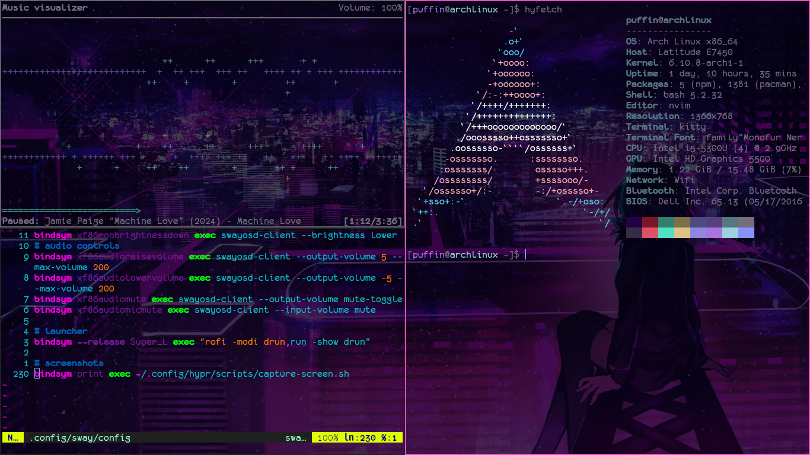

# dotfiles

My dotfiles for my Arch machine :3

Featured in screenshot:  
* Overall image is using swaywm
* Top left: ncmpcpp
* Bottom left: neovim opened to my sway config
* Right: hyfetch with trans flag :D
* Font (because it's kind of hard to read in the hyfetch): Monofur
* [Background](https://safebooru.org/index.php?page=post&s=view&id=3092501): by (as far as I know) tarbo (exxxpiation)

Things that you will need otherwise the config will either break or be less than functional:
* SwayOSD for volume/brightness controls
* rofi for application launcher
* grim and slurp for screenshots (please note that the screenshot script I use is suuupperr jank. Please read .config/hypr/scripts/capture-screen.sh)
